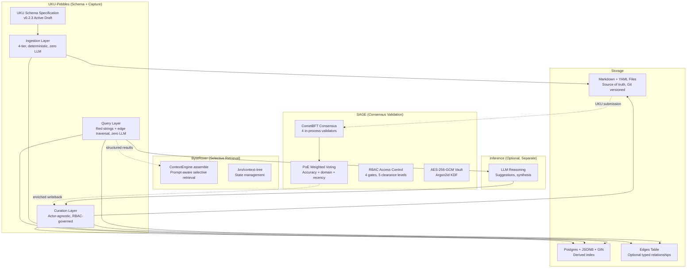

# System Architecture

## Overview

UKU-Pebbles defines a schema specification for Universal Knowledge Units -- structured Markdown+YAML descriptors that wrap human artifacts with experiential context. The architecture enforces a compile-time LLM boundary: three deterministic layers (Ingestion, Curation, Query) operate without any LLM, and an optional fourth layer (Inference) receives structured results only.

UKU-Pebbles is designed to operate within a three-project triad alongside SAGE (consensus validation) and ByteRover (selective retrieval).

## Triad Architecture



## Four-Layer Architecture (The Core Contract)

```
  Ingestion ─── Deterministic extraction. Zero LLM.
      │         Parse YAML, normalize, write to index.
      ▼
  Curation ──── Actor-agnostic (human or agent, RBAC-governed).
      │         Create edges, consolidate, build higher-order structures.
      ▼
  Query ──────── Pure deterministic retrieval. Red strings + optional edge traversal.
      │          No LLM. No embeddings. Just SQL.
      ▼
  Inference ──── Optional. Separate process. Receives structured results only.
                 LLM reasoning, synthesis, suggestions.
```

**The boundary between Layers 1-3 (deterministic) and Layer 4 (inference) is the single most important architectural contract.** The system is fully functional without Layer 4.

## Design Patterns

| Pattern | Where Applied | Purpose |
|---------|--------------|---------|
| Pebble-as-descriptor | Core model | Pebble wraps an artifact with context, not the artifact itself |
| Compile-time LLM boundary | 4-layer architecture | Deterministic core never depends on inference |
| Red strings | Query layer | Implicit connections from YAML key-value matches, zero manual linking |
| Progressive enhancement | Typed edges | Optional explicit relationships that never break core red-string functionality |
| Consolidation hierarchy | Higher-order structures | L0 raw -> L1 consolidations -> L2 MOCs -> L3+ meta-syntheses |
| File sovereignty | Storage | Markdown files are truth; index is derived cache |
| Actor-agnostic curation | RBAC | Humans and agents have same capabilities, governed by permissions |
| Conspiracy-board mental model | UX metaphor | Each pebble pinned to wall; red strings appear wherever attributes match |

## Key Design Decisions

### Pebble-as-Descriptor (v2.3)
**Context:** ai-pebbles treated the pebble as the artifact-plus-metadata. This created coupling between schema complexity and artifact complexity.
**Decision:** A pebble is a lightweight descriptor that wraps an external artifact with experiential context. The artifact (screenshot, PDF, recording) lives elsewhere; the pebble points to it. Multiple pebbles can reference the same artifact.
**Consequences:** Decouples schema from artifact format. Enables one-idea-per-pebble atomicity. Artifacts remain untouched.

### Compile-Time LLM Boundary
**Context:** ai-pebbles mixed LLM-dependent and LLM-free operations in the same pipeline (NAI engine was partly heuristic, partly ML).
**Decision:** Layers 1-3 are strictly LLM-free. Layer 4 (Inference) is a separate, optional process that only receives structured query results.
**Consequences:** System degrades gracefully without LLM. Deterministic core is testable, auditable, and sustainable. Clear integration boundary for SAGE and ByteRover.

### Red Strings Over Manual Linking
**Context:** Knowledge management tools typically require users to manually create links between notes.
**Decision:** Any matching YAML key-value pair across pebbles creates an implicit, symmetric connection (a "red string"). Computed on-demand from the JSONB+GIN index. Nothing written back to files.
**Consequences:** Zero-friction discovery. Connections emerge from capture, not curation. Some connections will be noisy; weighting model addresses this.

### Triad Architecture (UKU + SAGE + ByteRover)
**Context:** ai-pebbles tried to solve everything solo: capture, validation, sync, search, agents, encryption, economics.
**Decision:** Delegate validation to SAGE (BFT consensus), retrieval to ByteRover (.brv/context-tree), and focus UKU on schema + capture + experiential metadata.
**Consequences:** Dramatically reduced scope. Relies on external projects maturing alongside UKU. Risk: integration complexity; mitigation: all three use Markdown+YAML natively.

### Postgres JSONB+GIN (Recommended, Not Mandated)
**Context:** ai-pebbles specified Tantivy + SQLite FTS5 for search, tightly coupled to the app architecture.
**Decision:** Spec is retrieval-implementation-agnostic. JSONB+GIN recommended for sub-millisecond compound faceted search on any YAML field. Other backends (Elasticsearch, document stores) are valid implementations.
**Consequences:** More flexibility for implementers. Less prescriptive than ai-pebbles. Feasibility documented inline in the spec (WIP).

## Comparison: ai-pebbles vs uku-pebbles

| Dimension | ai-pebbles | uku-pebbles |
|-----------|-----------|-------------|
| Core model | Pebble = artifact + metadata | Pebble = descriptor wrapping external artifact |
| Architecture | Monolithic (Vault Core, Write Serializer, Sync, Search, Agents) | 4 bounded layers + triad delegation |
| LLM boundary | Mixed (NAI engine is partly heuristic, partly ML) | Compile-time: Layers 1-3 LLM-free, Layer 4 separate |
| Relationships | Typed ontological links only | Red strings (implicit) + typed edges (optional progressive enhancement) |
| Search | Tantivy + SQLite FTS5 | JSONB+GIN (recommended), retrieval-implementation-agnostic |
| Validation | Self (44 invariants, TLA+) | Delegated to SAGE BFT consensus |
| Retrieval | Bidirectional context engine | Delegated to ByteRover .brv/context-tree |
| Sync | Custom E2EE (AES-256-GCM, HLC, LWW) | Delegated to SAGE vault + consensus |
| Encryption | Custom per-pebble AES-256-GCM | Delegated to SAGE (AES-256-GCM + Argon2id) |
| Economics | Freemium $4.99/mo, break-even analysis | Not addressed (out of scope) |
| Maturity | 42 iterations, 16 docs, 271 verification scripts | v0.2.3 spec + discussions/insights/research |
| Scope | Full product specification | Schema + capture format + integration contracts |
