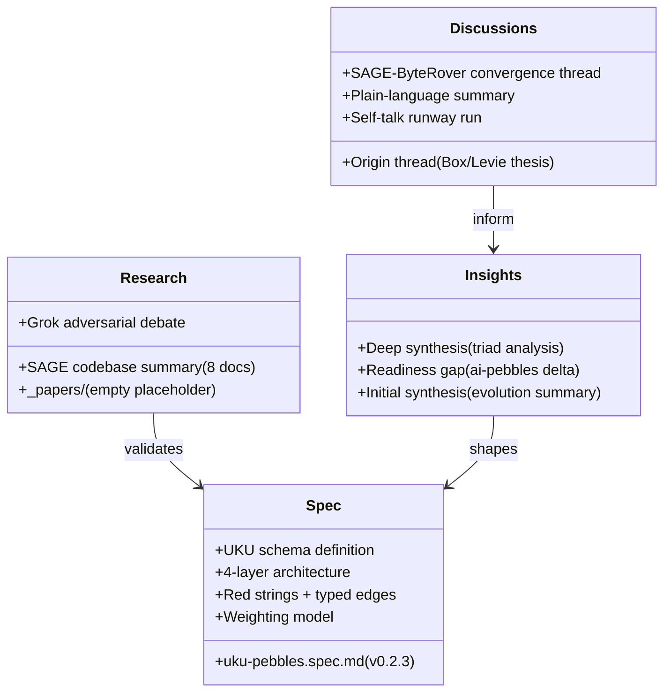

# Components

## Overview

## Component Details

### _specs/ (UKU Schema Specification)
**Purpose:** The authoritative specification for Universal Knowledge Units.
**Location:** `_specs/uku-pebbles.spec.md`

**Contents:**
- v0.2.3 (March 2026, Active Draft)
- Changelog (v2.1 -> v2.3)
- 10 core principles
- 4-layer architecture with compile-time LLM boundary
- 4-tier ingestion contract (zero-friction to LLM-assisted)
- YAML binding v1 (Obsidian-native)
- Relationship model (red strings + typed edges)
- Weighting model (explicit + implicit + effective)
- Higher-order structures (L0 raw -> L3+ meta-syntheses)
- Storage & indexing (Postgres JSONB+GIN)
- Field reference with controlled vocabularies
- Worked example pebble
- Appendices: Luhmann Test, Ekman 8, graph-eligible fields, bibliography

---

### _discussions/ (Origin Conversations)
**Purpose:** Raw, unedited transcripts and notes capturing how the project came together.
**Location:** `_discussions/`

| File | Date | Purpose |
|------|------|---------|
| uku-pebbles-luke-aaron-box-21MAR26.md | Mar 21 | X thread: Aaron Levie's "context is king" thesis + Luke's "interspecies shared caching layer" reframe |
| uku-pebbles-sage-byte-rover-21MAR26.md | Mar 21 | Full X thread transcript: three projects discover structural compatibility |
| uku-pebbles-plain-summary-21MAR26-093348.md | Mar 21 | Accessible explainer: what UKU is, the triad, why it matters for humans and agents |
| self-talk-runway-run-12APR26.md | Apr 12 | Planning framework: rhetorical situation analysis (target reader, workaround, Working Backwards) |

**Key participants:** Luke Jackson (@m31uk3), Aaron Levie (Box CEO, referenced), Andy Nguyen (@kevinnguyendn / ByteRover), l33tdawg (SAGE)

---

### _insights/ (Synthesis and Analysis)
**Purpose:** Analytical documents synthesizing findings across the project ecosystem.
**Location:** `_insights/`

| File | Date | Purpose |
|------|------|---------|
| uku-pebbles-synthesis-21MAR26-081150.md | Mar 21 | Executive summary: ai-pebbles -> uku-pebbles evolution, triad significance |
| uku-pebbles-deep-synthesis-21MAR26-083058.md | Mar 21 | Deep technical analysis: SAGE v5.0.7 capabilities, schema gap analysis (8 gaps), tidy data violations, "human in the mesh" operationalized |
| uku-pebbles-readiness-gap-21MAR26-091233.md | Mar 21 | Strategic readiness: what ai-pebbles work is now delegated to triad partners, what UKU must own, 10 priority actions |

**The readiness gap analysis is the most strategically important insight document.** It identifies what ai-pebbles research is now irrelevant (delegated to SAGE/ByteRover) versus what remains UKU's responsibility.

---

### _research/ (Design Research)
**Purpose:** External system analysis and adversarial design testing.
**Location:** `_research/`

#### _research/sage/ (SAGE Codebase Summary)
8 documentation files summarizing SAGE (Sovereign Agent Governed Experience) v5.0.7:

| File | Purpose |
|------|---------|
| index.md | Primary context file for SAGE |
| architecture.md | CometBFT consensus, 2-store architecture, ABCI state machine |
| components.md | 13 internal packages (abci, auth, embedding, mcp, memory, poe, store, vault, etc.) |
| data_models.md | MemoryRecord schema, 19 database tables, relationship model |
| interfaces.md | 25+ REST endpoints, 15+ MCP tools, Ed25519 authentication |
| workflows.md | Memory submission, consensus voting, PoE scoring, vault encryption |
| dependencies.md | Go 1.23, CometBFT 0.38, PostgreSQL+pgvector, BadgerDB, Ollama |
| review_notes.md | Consistency and completeness findings |

**Key SAGE facts:**
- Production infrastructure: 252 files, Go 1.23, CometBFT BFT consensus
- 4 in-process validators (sentinel, dedup, quality, consistency) with 3/4 quorum
- PoE (Proof of Expertise) weighted voting
- AES-256-GCM vault encryption with Argon2id KDF
- 15+ MCP tools for agent integration
- 3 deployment modes: personal (SQLite), multi-agent (Docker+PostgreSQL), MCP server

#### _research/grok-debate-testing/ (Adversarial Design Testing)
Two documents from a 10-round adversarial debate between Luke Jackson and Grok:
- `rough-idea.md` -- Full debate transcript (YAML vs embeddings, metadata vs semantic search, LLM-free viability)
- `summary.md` -- Distilled design implications, leading to the "pebble-as-descriptor" and "AGENTS.md for life" framing

**Key debate outcomes that shaped v2.3:**
- Pebble-as-descriptor model (not artifact)
- 4-tier ingestion contract
- Compile-time LLM boundary
- Red strings as primary discovery mechanism
- Spec is retrieval-implementation-agnostic

#### _research/_papers/ (Empty placeholder)
No papers yet. Presumably for academic references.

---

### Configuration Files

**.claude/settings.local.json:** Claude Code permissions -- allows Python execution and find commands targeting the SAGE codebase at `/Users/ljack/github/resources/code/sage/`, plus git push.

**_dependencies/** -- Empty placeholder directory for future dependency documentation.
