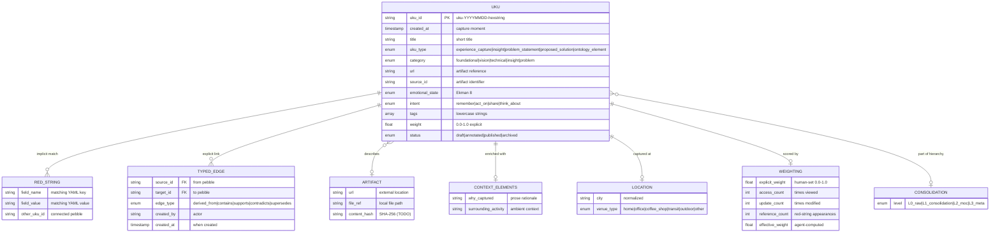

# Data Models

## Entity Relationship Diagram

## Model Details

### UKU (Core Entity)
**Storage:** Individual Markdown file with YAML frontmatter
**Purpose:** Atomic unit of knowledge -- one idea, one artifact reference, one experiential context

**Key semantic distinctions from ai-pebbles Pebble:**
- UKU is a **descriptor**, not the artifact itself
- Multiple UKUs can reference the same artifact
- Body text is a human/agent-written summary, not the artifact content
- Frontmatter is the experiential index; body is prose context

**Required fields:** `title`, `uku_id`, `created_at`, `uku_type`, `category`

**Fluid schema:** Any YAML key-value pair beyond the defined fields is valid and will participate in red-string matching if graph-eligible.

### Red String (Implicit Relationship)
**Storage:** Not stored; computed on-demand from JSONB+GIN index
**Purpose:** Automatic, symmetric connections between pebbles sharing YAML key-value matches

A red string exists between two UKUs whenever they share a value for any graph-eligible field. Red strings have no explicit representation in any table -- they emerge from index queries.

**Graph-eligible criterion (Luhmann Test):** A field value passes if a stranger would understand it without context. `emotional_state: joy` passes; `why_captured: "Kevin just replied"` fails.

### Typed Edge (Explicit Relationship)
**Storage:** Optional edges table (source_id, target_id, edge_type, created_by, created_at)
**Purpose:** Directional, explicit relationships created during Curation

Typed edges are a progressive enhancement. The system works fully without them. They enable the consolidation hierarchy (L0 -> L1 -> L2 -> L3+) and reasoning chains (supports, contradicts).

Cascading deletes: if a pebble is deleted, all edges referencing it are removed.

### Weighting (Three-Layer Scoring)
**Storage:** Explicit weight in file; implicit signals and effective weight in index only
**Purpose:** Determine relative importance of pebbles for query ranking and agent attention

**Explicit:** Human-set `weight` field (0.0-1.0). Written to the `.md` file.
**Implicit:** Behavioral signals tracked in the index (access_count, update_count, reference_count, temporal recency). Never written back to files.
**Effective:** Agent-computed combination. Considers pattern weights (category access frequency, tag span across high-weight pebbles), time decay, and signal fusion.

### Consolidation Hierarchy
**Storage:** Expressed via typed edges, not file frontmatter
**Purpose:** Build higher-order knowledge structures from atomic pebbles

| Level | Type | Edge to Parents |
|-------|------|-----------------|
| L0 | Raw pebbles | None (atomic captures) |
| L1 | Consolidations | `derived_from` edges to L0 sources |
| L2 | Maps of Content (MOCs) | `contains` edges to grouped pebbles |
| L3+ | Meta-syntheses | `contains` or `derived_from` to lower levels |

Each higher-order structure is itself a UKU (same `.md` + YAML format).

### SAGE MemoryRecord (External, for Integration Reference)

SAGE's core entity for comparison:

| Field | Type | UKU Equivalent |
|-------|------|---------------|
| memory_id | UUID | uku_id |
| submitting_agent | string (Ed25519 pubkey) | No equivalent (TODO) |
| content | text | Body text |
| memory_type | enum (fact/observation/inference/task) | uku_type (different taxonomy) |
| domain_tag | string | No equivalent (TODO) |
| confidence_score | float64 | weight (partial) |
| status | enum (proposed/validated/committed/challenged/deprecated) | status (different lifecycle) |
| clearance_level | int (0-4) | No equivalent (TODO) |

**8 gaps identified in deep synthesis:** type mapping, domain classification, typed links, privacy levels, content integrity (hash), decay factors, status lifecycle, agent enrichment writeback.

### Fields Identified as Missing (from Readiness Gap Analysis)

These fields exist in ai-pebbles' Pebble Schema but are not yet in UKU v0.2.3:

| Missing Field | ai-pebbles Source | Priority |
|---------------|-------------------|----------|
| people | Tier 2 enrichment | High |
| tools | Tier 2 enrichment | Medium |
| tasks | Tier 2 enrichment | Medium |
| location (full) | Tier 2 enrichment (GPS + precision levels) | Medium |
| media_refs | Tier 3 relations | Medium |
| extraction_provenance | Per-field ML tracking | High (for SAGE integration) |
| consent_snapshot | Immutable consent state at capture | High (for privacy) |
| source_app | Tier 1 required | High |
| content_hash | SHA-256 | High (for SAGE dedup) |
| clearance_level | (from SAGE) | Medium |
| domain_tag | (from SAGE) | Medium |

### Tidy Data Violations (Known)

Two fields in the current spec violate the tidy data invariant inherited from ai-pebbles:

1. **context_elements.emotional_state** -- Currently prose (e.g., "Excited + slightly annoyed"). Should be atomized using Ekman 8 enum with `{value, confidence, provenance}` triples.
2. **context_elements.intent** -- Currently prose. Should be typed enum: `remember`, `act_on`, `share`, `think_about`.

Note: The top-level `emotional_state` and `intent` fields ARE atomized (Ekman 8 and 4-value enum respectively). The violation is in the `context_elements` sub-object which allows freeform prose.
