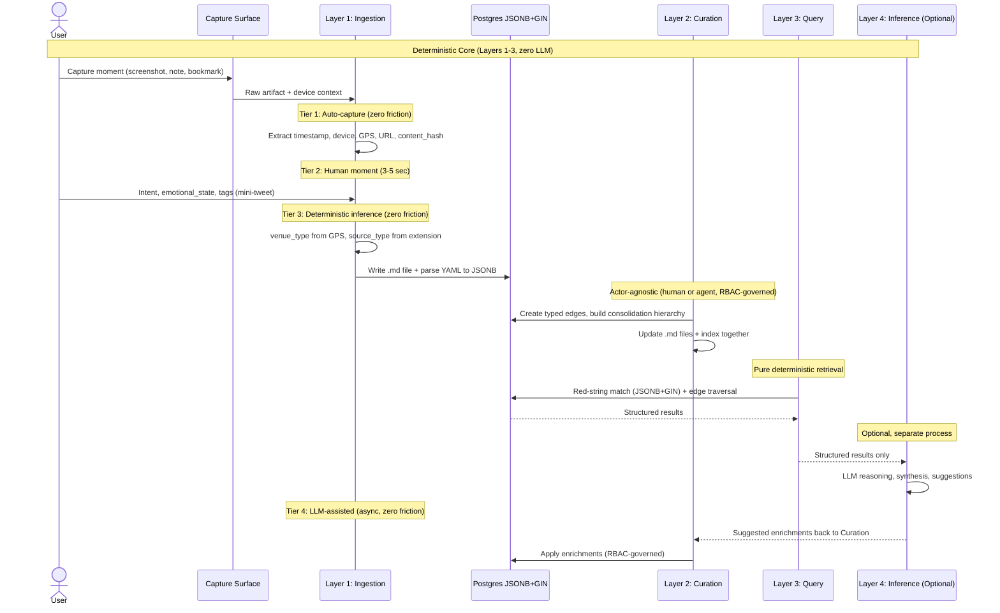
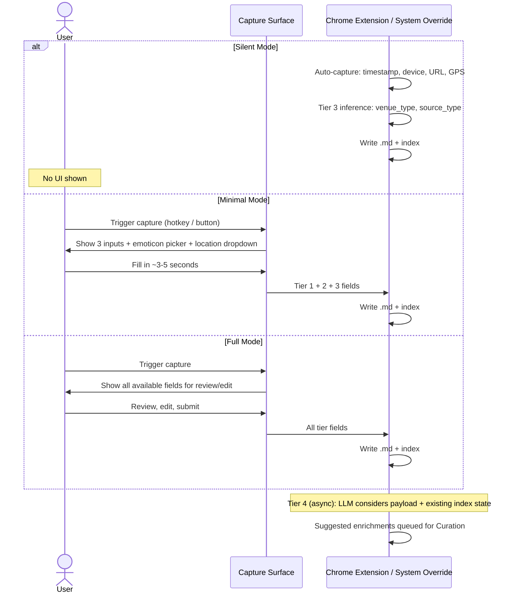
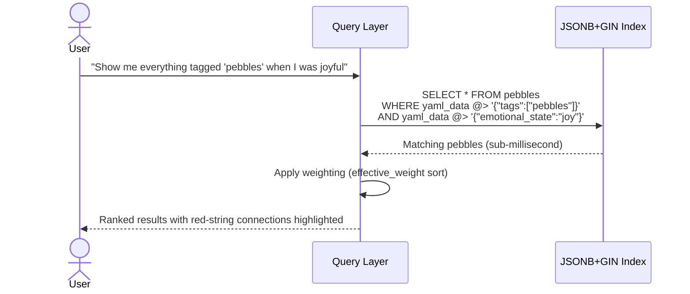
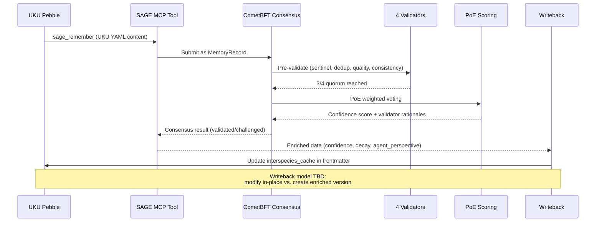
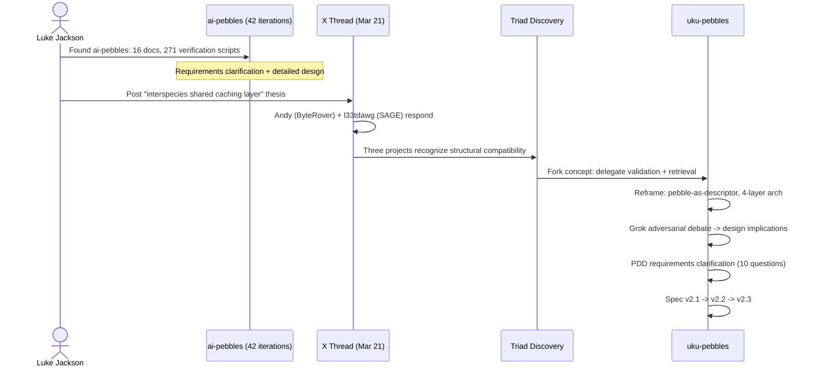

# Workflows

## Four-Layer Processing Pipeline



### Error Handling
| Scenario | Handling |
|----------|----------|
| YAML parse failure | Reject at ingestion; file not indexed |
| Missing required fields | Reject at ingestion; log validation error |
| Inference layer unavailable | System fully functional on Layers 1-3 only |
| Edge target not found | Cascading delete cleans up orphan edges |
| GIN index corruption | Rebuild from source `.md` files (files are truth) |

---

## Capture Flow (Specified UX)

Three capture modes (user preference):



**Collapsible drill-down:** Start at user's preferred level, go deeper when desired.

---

## Red-String Query Flow



Red strings are computed at query time. No precomputed link table needed for implicit connections.

---

## Curation Workflow

```mermaid
sequenceDiagram
    actor Actor as Human or Agent (RBAC-governed)
    participant Files as Markdown Files
    participant Index as Postgres Index
    participant Edges as Edges Table

    Note over Actor,Edges: Any actor with RBAC write permission

    alt Edit existing pebble
        Actor->>Files: Modify YAML frontmatter or body
        Actor->>Index: Re-index modified file
    else Create typed edge
        Actor->>Edges: INSERT (source, target, type, actor, timestamp)
    else Build consolidation
        Actor->>Files: Create new L1/L2/L3 pebble (.md file)
        Actor->>Edges: Create derived_from or contains edges
        Actor->>Index: Index new pebble
    end
```

**Key principle:** Files and index are always updated together during curation. Enrichments are deliberate actions, not background side effects.

---

## SAGE Integration Pipeline (Specified, Not Built)



### Open Integration Questions (from TODO.md)
- UKU-to-SAGE submission pipeline: UKU YAML -> MCP sage_remember -> consensus -> enriched writeback
- Writeback model: modify original `.md` in-place or create enriched version?
- Type mapping: uku_type <-> SAGE memory_type bidirectional
- Status lifecycle handoff: draft/published -> proposed/committed
- Consent reconciliation: UKU consent model <-> SAGE access grants

---

## Research & Design Methodology



### Evolution Arc
1. **ai-pebbles** -- Solo monolithic specification (schema + app + sync + search + agents + economics)
2. **Triad discovery** -- SAGE and ByteRover solve validation, retrieval, and encryption
3. **uku-pebbles** -- Focused specification (schema + capture format + integration contracts)
4. **Grok debate** -- Adversarial stress-testing produces pebble-as-descriptor, compile-time LLM boundary
5. **v2.3** -- Current: atomized fields, 4-layer architecture, 4-tier ingestion, weighting model
