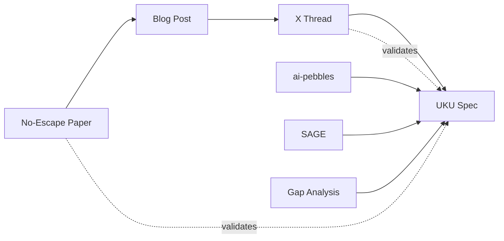

# Source Validation Matrix

## Sources Processed

| # | Source | Type | Author(s) | Date | Credibility | Key Contribution |
|---|--------|------|-----------|------|-------------|-----------------|
| S1 | "The Price of Meaning" paper (arxiv 2603.27116v1) | Peer-reviewed formal proof | Gopinath et al. (MIT + Sentra) | 2026-03-28 | High (formal theorems, 5 architectures, reproducible) | No-Escape Theorem: forgetting and false recall are mathematically inevitable for any semantic memory system |
| S2 | "The Price of Meaning" blog post / X thread | Technical summary | Ashwin Gopinath (@ashwingop) | 2026-04-10 | High (author is paper author) | Accessible explanation of theorems + engineering implications |
| S3 | X thread discussion (andy + luke + limits_stop) | Technical conversation | Andy Nguyen, Luke Jackson, @limits_stop | 2026-04-10 to 2026-04-12 | High (practitioners building systems) | ByteRover Memory Swarm architecture, "decorrelate failure" principle |
| S4 | UKU-Pebbles spec v0.2.3 | Design specification | Luke Jackson | 2026-03 | High (primary source) | 4-layer architecture, red strings, compile-time LLM boundary |
| S5 | UKU-Pebbles codebase summary (.sop/summary/) | Generated analysis | Analysis session | 2026-04-12 | High (derived from S4) | Full spec decomposition, triad architecture, known gaps |
| S6 | ai-pebbles codebase summary (.sop/summary/) | Generated analysis | Analysis session | 2026-04-12 | Medium (superseded repo) | Historical context, 42-iteration spec evolution, verification scripts |
| S7 | SAGE codebase summary (_research/sage/) | Derived analysis | Analysis of SAGE v5.0.7 | 2026-03 | High (from production code) | BFT consensus, PoE scoring, RBAC, vault encryption |
| S8 | Readiness gap analysis (_insights/) | Strategic analysis | Synthesis session | 2026-03-21 | High (cross-references S4-S7) | What UKU owns vs delegates, 10 priority actions |

## Source Relationship Map

## Convergence Assessment

**All eight sources converge on one thesis:** Exact episodic storage (files, structured metadata, keyword matching) is the interference-immune foundation. Semantic reasoning is a separate, optional layer that navigates the interference-usefulness tradeoff frontier but can never escape it. The boundary between these layers is the critical architectural contract.

**No source contradicts this thesis.** The No-Escape Theorem (S1) provides formal mathematical proof. ByteRover's Memory Swarm (S3) provides empirical validation. UKU's 4-layer architecture (S4) provides the design framework. SAGE (S7) provides the external symbolic verifier. The convergence is structural, not coincidental.
