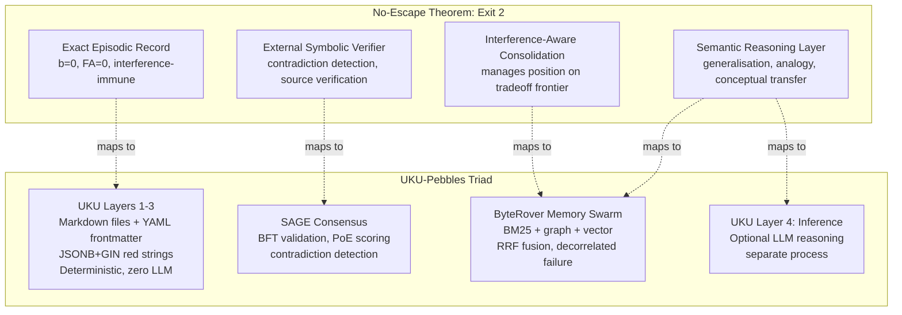

# Convergence Analysis: No-Escape Theorem x UKU-Pebbles x Triad

## Executive Summary

The No-Escape Theorem provides formal mathematical validation of UKU-Pebbles' architectural decisions. The theorem proves that the only principled path for long-term memory is **Exit 2: exact episodic record + external semantic reasoning**. The UKU-Pebbles triad (UKU + SAGE + ByteRover) implements exactly this architecture, arrived at empirically before the theorem existed.

---

## The Mapping

### No-Escape Theorem Exit 2 Components -> Triad Architecture

### Component-Level Mapping

| No-Escape Requirement | UKU Triad Component | Evidence |
|----------------------|---------------------|---------|
| **Exact episodic record** (b=0, FA=0) | UKU Layers 1-3: Markdown files are the source of truth. YAML frontmatter is the structured index. JSONB+GIN provides sub-millisecond exact matching. | Paper: BM25/filesystem achieves b=0, FA=0. UKU red strings ARE structured exact matching on controlled vocabularies. |
| **External symbolic verifier** | SAGE: BFT consensus with 4 validators (sentinel, dedup, quality, consistency). PoE weighted voting. Contradiction detection. | Paper: "Add an external verification layer that provides exact episodic grounding." SAGE literally provides consensus-validated memory. |
| **Semantic reasoning** (for generalisation) | ByteRover Memory Swarm: BM25 + wikilink graph expansion + hybrid vector+keyword, fused with RRF. | Paper: "Use semantic representations for what they are good at (generalisation, analogy, conceptual transfer)." ByteRover navigates the frontier with decorrelated failure modes. |
| **Interference-aware consolidation** | UKU consolidation hierarchy: L0 raw -> L1 consolidations -> L2 MOCs -> L3+ meta-syntheses. SAGE PoE scoring provides quality weighting. | Paper Solution 4: Compression at k=2,500 achieves b=0.163, accuracy=92.8%. Consolidation IS compression. |

---

## Red Strings > BM25

The paper measures BM25 at only **15.5% semantic agreement** -- because BM25 matches on arbitrary tokens. UKU red strings match on **curated, controlled-vocabulary YAML fields**:

| Red String Field | Vocabulary | Why Better Than BM25 |
|-----------------|------------|---------------------|
| uku_type | 5 values (experience_capture, insight, problem_statement, proposed_solution, ontology_element) | Exact categorical match, semantically meaningful |
| emotional_state | Ekman 8 (joy, sadness, anger, fear, surprise, disgust, trust, anticipation) | Psychologically validated taxonomy |
| intent | 4 values (remember, act_on, share, think_about) | Maps directly to user's relationship with artifact |
| category | 5 values (foundational, vision, technical, insight, problem) | Domain-aware classification |
| tags | User-defined, lowercase | Human-curated semantic labels |
| location.venue_type | 6 values (home, office, coffee_shop, transit, outdoor, other) | Environmental context |

**Key insight:** Red strings on structured YAML achieve the interference immunity of BM25 (b=0, FA=0) while providing MUCH higher semantic agreement than raw BM25 because the fields are pre-categorised by controlled vocabularies. The 15.5% limitation is an artifact of BM25 matching on unstructured text. Red strings match on structured, curated metadata.

This is a **new point on the Pareto frontier** that the paper didn't test: structured metadata matching sits between BM25 (high immunity, low usefulness) and vector similarity (high usefulness, high interference).

---

## ByteRover Memory Swarm = Decorrelated Frontier Navigation

Andy's architecture directly implements the paper's engineering guidance:

> "You don't escape the tradeoff frontier, you navigate it by mixing methods that fail in uncorrelated ways."

| Method | Blind Spot | Paper Category |
|--------|-----------|---------------|
| BM25 | Misses paraphrases | Category 3 (immune, low usefulness) |
| Wikilink graph expansion | Misses unlinked knowledge | Category 1 (geometric, forgetting) |
| Hybrid vector+keyword | Misses exact terms | Category 1 (geometric, forgetting) |
| **RRF fusion** | **Decorrelates all three** | **Frontier navigation** |

ByteRover achieves **96.1% on LoCoMo** (92.8% on LongMemEval-S) -- empirical proof that frontier navigation works.

The paper's own data supports this: compression at k=2,500 achieves b=0.163 with 92.8% accuracy. ByteRover's multi-method fusion is a more sophisticated version of the same principle.

---

## SAGE = The External Symbolic Verifier

The paper's Exit 2 requires "an external verification layer that provides exact episodic grounding." SAGE provides:

| Paper Requirement | SAGE Implementation |
|-------------------|-------------------|
| Exact episodic grounding | Content stored as encrypted records; consensus validates accuracy |
| Contradiction detection | Quality validator + consistency validator in pre-filter |
| Source verification | PoE weighted voting (accuracy + domain expertise + recency) |
| Provenance tracking | Ed25519 cryptographic identity for every agent and human |
| Standing policy consent | RBAC with 4 gates, 5 clearance levels |

SAGE's BFT consensus is structurally equivalent to the paper's "external symbolic verifier" -- it validates memories against each other and against established facts, preventing the drift that semantic systems inevitably produce.

---

## Consolidation Hierarchy = Interference-Aware Compression

The paper's Solution 4 (compression) shows the most promising engineering tradeoff: at k=2,500 clusters, b drops from 0.440 to 0.163 while accuracy only drops from 100% to 92.8%.

UKU's consolidation hierarchy maps directly:

| UKU Level | Compression Analogue | Function |
|-----------|---------------------|----------|
| L0: Raw pebbles | Individual memories | Full episodic detail, zero compression |
| L1: Consolidations | k=large clusters | Group related pebbles, preserve detail |
| L2: MOCs | k=medium clusters | Thematic organisation, moderate compression |
| L3+: Meta-syntheses | k=small clusters | High-level patterns, maximum compression |

**Design implication:** The consolidation hierarchy should be designed as an interference-management strategy, not just an organisational convenience. Each level trades detail for reduced competitor density in the semantic space.

---

## What the Theorem Validates About UKU

| UKU Design Decision | Theorem Validation |
|---------------------|-------------------|
| **Compile-time LLM boundary** (Layers 1-3 are LLM-free) | Theorem 7: separating exact episodic record from semantic reasoning is the only principled architecture |
| **Red strings as primary discovery** | BM25/filesystem achieves b=0, FA=0. Structured metadata matching is the interference-immune foundation. |
| **Typed edges as progressive enhancement** | Graph memory still hits b=0.478. Edges that rely on semantic similarity inherit interference. Edges from curation (human/agent) are safe. |
| **Files are source of truth; index is derived** | The episodic record must be exact. Files ARE the exact record. The index can be rebuilt. |
| **Inference is optional and separate** | Layer 4 is explicitly outside the deterministic core. The system works without it. This is exactly Exit 2. |
| **Pebble-as-descriptor** | Decoupling the descriptor from the artifact means the episodic record is lightweight and scales independently of artifact size. |
| **Fluid schema** | New YAML fields create new red-string dimensions. Each new controlled vocabulary field is a new interference-free matching axis. |

---

## What the Theorem Challenges About UKU

| Challenge | Detail | Implication |
|-----------|--------|-------------|
| **Red string scaling** | As pebble count grows, red-string matches will grow quadratically. More matches ≠ better matches. | Need a weighting/ranking mechanism beyond simple matching. The weighting model (explicit + implicit + effective) addresses this but needs implementation. |
| **Tier 4 ingestion (LLM-assisted)** | Any LLM-assigned attributes inherit the semantic interference of the LLM's internal representations. | Tier 4 attributes should carry provenance marking them as LLM-inferred. Users/agents should be able to filter to human-curated-only attributes for interference-free querying. |
| **Consolidation is lossy** | Moving from L0 to L1+ is compression. The theorem shows compression reduces b but also reduces accuracy (92.8% at k=2,500). | L0 pebbles should NEVER be deleted when consolidations are created. Consolidation adds a layer; it doesn't replace the episodic record. |
| **ByteRover's semantic layer** | ByteRover's vector+keyword hybrid still inherits geometric vulnerability for the semantic component. | This is expected and acceptable. The point is navigating the frontier, not escaping it. BM25 (and red strings) provide the interference-immune base. |

---

## The "Structured Metadata" Hypothesis

The paper tests BM25 on unstructured text (15.5% semantic agreement). It does NOT test structured metadata matching. We hypothesise:

**Structured metadata matching on controlled vocabularies occupies a new, untested point on the Pareto frontier: high interference immunity (approaching b=0) with significantly higher semantic agreement than raw BM25 (well above 15.5%).**

**Why:** Controlled vocabularies (Ekman 8 emotions, 5 uku_types, 4 intents) embed semantic meaning into the field values themselves. Matching `emotional_state: joy` across pebbles is an exact string match (interference-immune) that also carries semantic meaning (joy ≈ positive experience). The semantic information is encoded in the vocabulary design, not in the retrieval geometry.

**This is testable.** A proof-of-concept with real UKU pebbles could measure:
1. Interference immunity (b, FA) of red-string matching
2. Semantic agreement between red-string results and vector similarity results
3. Whether the structured metadata point sits above the paper's Pareto frontier

---

## Implications for Implementation Priority

Given the theorem's validation, the implementation priority shifts:

### Build First (Interference-Immune Foundation)
1. **UKU file format + YAML parser** -- The exact episodic record
2. **JSONB+GIN index + red-string queries** -- The interference-immune retrieval layer
3. **Ingestion pipeline (Tiers 1-3)** -- Deterministic, zero LLM
4. **CLI tool for creating pebbles** -- Capture surface

### Build Second (Frontier Navigation)
5. **Weighting model** -- Rank red-string results by relevance
6. **Typed edges + consolidation hierarchy** -- Interference-aware compression
7. **ByteRover integration** -- Semantic layer on top of exact foundation
8. **Tier 4 ingestion** -- LLM-assisted attribute inference (with provenance)

### Build Third (External Verification)
9. **SAGE integration** -- Consensus validation, contradiction detection
10. **Provenance tracking** -- Per-field source tracking for trust calibration
