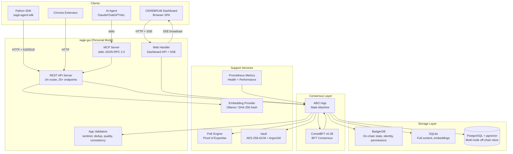

# SAGE Architecture

## System Architecture

## Layer Descriptions

### Client Layer
- **AI Agents** connect via MCP (stdio) or REST API with Ed25519 signed requests
- **CEREBRUM Dashboard** is a vanilla JS SPA served at `/ui/` with real-time SSE updates
- **Python SDK** (`sage-agent-sdk` on PyPI) provides sync/async HTTP clients with automatic request signing
- **Chrome Extension** injects SAGE memory tools into browser-based AI interfaces

### Application Layer
- **MCP Server** — JSON-RPC 2.0 over stdio; 15+ tools (`sage_remember`, `sage_recall`, `sage_vote`, etc.); manages memory modes (full/bookend/on-demand)
- **REST API Server** — chi router with middleware (auth, CORS, rate limiting, logging); 25+ endpoints for memory, voting, RBAC, agents, organizations, pipeline
- **Web Handler** — Dashboard-specific endpoints; SSE broadcaster for real-time events; vault lock/unlock; LAN pairing; network management

### Consensus Layer
- **CometBFT v0.38** — Byzantine Fault Tolerant consensus engine; handles block proposal, voting, finalization
- **ABCI App** (`SageApp`) — Deterministic state machine implementing ABCI 2.0 interface; processes transactions in `FinalizeBlock`, buffers writes, atomically flushes in `Commit`
- **App Validators** — 4 in-process validators (sentinel, dedup, quality, consistency) with BFT 3/4 quorum requirement before on-chain submission

### Storage Layer
- **BadgerDB** — Embedded KV store for on-chain state: agent nonces, identity, access grants, org membership, domain registry, state hashes
- **SQLite** (personal mode) — File-based store for full memory content, embeddings, votes, challenges, tags, knowledge triples
- **PostgreSQL + pgvector** (multi-node) — Shared queryable store with HNSW vector indexing for semantic similarity search

### Support Services
- **PoE Engine** — Calculates validator weights using geometric mean of accuracy, domain expertise, recency, and corroboration (with 10% reputation cap)
- **Vault** — AES-256-GCM encryption for memory content and embeddings; key derived via Argon2id from user passphrase; recovery key support
- **Embedding Provider** — Ollama (nomic-embed-text, 768-dim) for semantic embeddings; SHA-256 hash fallback for testing
- **Prometheus Metrics** — Block height, transaction throughput, vote accuracy, query latency, DB operation counts

## Design Patterns

### 1. Two-Store Architecture
SAGE separates on-chain state (BadgerDB) from off-chain content (PostgreSQL/SQLite). BadgerDB is the source of truth for identity and permissions — fast O(1) lookups for nonces, access grants, agent keys. The off-chain store holds full memory text, vector embeddings, and queryable metadata. This separation enables the ABCI app to be deterministic (only hashes on-chain) while supporting rich queries off-chain.

### 2. Buffered Atomic Commit
The ABCI app buffers all writes during `FinalizeBlock` into a `pendingWrites` slice. On `Commit`, everything is flushed atomically to the off-chain store. This ensures consistency between on-chain state and off-chain content — either an entire block's changes apply or none do.

### 3. Interface-Driven Storage
All storage backends implement shared Go interfaces (`MemoryStore`, `AccessStore`, `OrgStore`, `AgentStore`, etc.). This enables SQLite for personal mode and PostgreSQL for multi-node with zero application code changes. The `store.go` file defines interfaces; `badger.go`, `postgres.go`, and `sqlite.go` implement them.

### 4. Ed25519 Dual Verification
Every memory submission carries embedded proof fields (agent public key, signature, timestamp, body hash). The REST layer verifies the request signature via HTTP headers. The ABCI layer independently re-verifies the on-chain proof via `auth.VerifyAgentProof()`. This prevents the REST layer from spoofing agent identity.

### 5. BFT Application Validators
Before any memory reaches consensus, it passes through 4 in-process validators (sentinel, dedup, quality, consistency). A `/v1/memory/pre-validate` endpoint allows dry-run validation. This pre-filters noise before incurring consensus overhead.

### 6. PoE Weighted Voting
Validator votes are weighted by a geometric mean of four factors: accuracy (EWMA of vote history), domain expertise (votes in the specific domain), recency (time decay), and corroboration count. A 10% reputation cap prevents single-validator dominance. Quorum requires 2/3 of total weighted votes.

### 7. Memory Modes for Token Control
Three modes control how much context an agent spends on memory: `full` (every turn), `bookend` (boot + reflect only), `on-demand` (zero automatic usage). This allows users to tune the tradeoff between memory persistence and token costs.

### 8. RBAC Access Control (Fail-Secure)
Memory visibility checks 4 gates in order: (1) direct agent match, (2) domain access grant with clearance level, (3) organization membership, (4) federation (cross-org). If no gate passes, the memory is invisible. DomainAccess and multi-org gates are alternatives, not stacked.

## Key Design Decisions

| Decision | Rationale |
|----------|-----------|
| CometBFT for consensus | BFT guarantees with proven battle-tested implementation; single-node and multi-node without code changes |
| SQLite for personal mode | Zero-config, file-based, pure Go driver (no CGo); portable across platforms |
| BadgerDB for on-chain state | Embedded, high-performance KV; no external dependency for identity/permission lookups |
| Ed25519 over ECDSA | Deterministic signatures, faster verification, no side-channel risk from nonce reuse |
| AES-256-GCM + Argon2id | Authenticated encryption prevents tampering; Argon2id is memory-hard (resistant to GPU brute force) |
| Vanilla JS frontend | No build step, no npm dependencies for the dashboard; embedded via Go `embed` |
| chi router | Lightweight, idiomatic Go HTTP router with middleware chain support |
| Protobuf for transactions | Deterministic serialization for signature verification; compact wire format |
| 4 application validators | Pre-filter noise before consensus; sentinel ensures liveness; BFT 3/4 quorum mirrors consensus |
