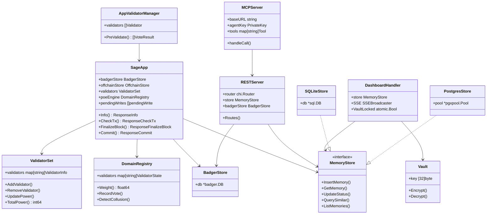

# SAGE Components

## Binary Entrypoints (`cmd/`)

### amid — ABCI Daemon
- **Location:** `cmd/amid/main.go` (268 lines)
- **Purpose:** Core blockchain node for multi-agent deployments
- **Modes:** In-process (embedded CometBFT) or standalone ABCI TCP server
- **Dependencies:** BadgerStore, PostgresStore, ValidatorSet, PoE engine, REST server, metrics
- **Key flags:** `--home`, `--postgres-url`, `--rest-addr`, `--metrics-addr`, `--badger-path`

### sage-gui — Personal Desktop App
- **Location:** `cmd/sage-gui/` (13 files)
- **Purpose:** All-in-one personal node: CometBFT + REST + dashboard + MCP server
- **Commands:** `serve`, `mcp`, `mcp install`, `setup`, `seed`, `export`, `import`, `backup`, `recover`, `quorum-init`, `quorum-join`, `status`
- **Dependencies:** SQLiteStore, BadgerStore, MCP server, web handler, vault, embedding
- **Key files:**
  - `main.go` — CLI entry, command routing
  - `node.go` — CometBFT node lifecycle
  - `node_controller.go` — Node start/stop/restart management
  - `mcp.go` — MCP server configuration and hook installation
  - `config.go` — SAGE_HOME, provider detection, path resolution
  - `wizard.go` — Interactive setup (pick AI provider, configure vault)
  - `vault.go` — Vault passphrase management, recovery key
  - `seed.go` — Bootstrap memories from file
  - `migrate.go` — Database schema migrations across versions
  - `quorum.go` — Multi-agent network initialization

### sage-cli — CLI Tools
- **Location:** `cmd/sage-cli/main.go` (144 lines)
- **Purpose:** Diagnostics and key generation
- **Commands:** `keygen`, `status`, `health`

### sage-launcher — Desktop Launcher
- **Location:** `cmd/sage-launcher/` (4 files)
- **Purpose:** macOS/Windows process launcher with platform-specific process management
- **Key files:** `proc_other.go` (Unix), `proc_windows.go` (Windows)

### sage-tray — System Tray (macOS)
- **Location:** `cmd/sage-tray/main.swift`
- **Purpose:** macOS menu bar app

## Internal Packages (`internal/`)

### abci — ABCI State Machine
- **Location:** `internal/abci/` (5 files)
- **Purpose:** CometBFT ABCI 2.0 application; processes all transactions deterministically
- **Key struct:** `SageApp` — implements `abcitypes.Application`
- **Key files:**
  - `app.go` (77.6KB) — All transaction processors: memory submit/vote/challenge/corroborate, agent register/update, org operations, federation, RBAC, domain registration
  - `state.go` — `AppState` (nonces, heights, validator set)
  - `migrate.go` — State migration between versions
- **Dependencies:** store (BadgerStore + OffchainStore), validator, poe, auth, tx, memory, appvalidator

### appvalidator — Pre-Validation Layer
- **Location:** `internal/appvalidator/` (4 files)
- **Purpose:** 4 built-in validators that pre-filter memories before consensus
- **Validators:**
  1. **Sentinel** — Always accepts (ensures liveness)
  2. **Dedup** — Rejects duplicate content (SHA-256 hash)
  3. **Quality** — Rejects noise (min 20 chars, greeting filter, empty header filter)
  4. **Consistency** — Enforces confidence 0-1, required fields, valid status values
- **Interface:** `Validator` with `Name()` and `Validate()` methods
- **Quorum:** 3/4 validators must accept

### auth — Cryptographic Identity
- **Location:** `internal/auth/` (2 files)
- **Purpose:** Ed25519 keypair generation, request signing/verification, on-chain proof verification
- **Key functions:**
  - `GenerateKeypair()` — Create Ed25519 keypair
  - `SignRequest()` / `VerifyRequest()` — REST API request auth
  - `VerifyAgentProof()` — On-chain signature verification (independent of REST layer)
  - `PublicKeyToAgentID()` / `AgentIDToPublicKey()` — Hex encoding

### embedding — Vector Generation
- **Location:** `internal/embedding/` (4 files)
- **Purpose:** Generate vector embeddings for semantic similarity search
- **Providers:**
  - `OllamaProvider` — nomic-embed-text (768-dim) via local Ollama server
  - `HashProvider` — SHA-256 deterministic vector (fallback/testing)
- **Interface:** `Provider` with `Embed(ctx, text) ([]float32, error)`

### mcp — MCP Protocol Server
- **Location:** `internal/mcp/` (4 files)
- **Purpose:** Model Context Protocol server over stdio (JSON-RPC 2.0)
- **Key struct:** `Server` with tools map, agent key, memory mode, recall settings
- **Tools (15+):**
  - Memory: `sage_remember`, `sage_recall`, `sage_forget`, `sage_list`, `sage_timeline`, `sage_status`
  - Agent: `sage_register`, `sage_agent_info`
  - Governance: `sage_vote`, `sage_challenge`, `sage_corroborate`
  - RBAC: `sage_access_request`, `sage_access_list`
  - Pipeline: `sage_pipe_send`, `sage_pipe_status`
- **Key files:**
  - `server.go` (15.5KB) — Server lifecycle, JSON-RPC dispatch, memory mode handling
  - `tools.go` (59KB) — Tool definitions and implementations

### memory — Domain Models
- **Location:** `internal/memory/` (6 files)
- **Purpose:** Core domain types, validation, confidence scoring, lifecycle helpers
- **Key types:**
  - `MemoryRecord` — UUID, content, hash, embedding, type, domain, confidence, status, timestamps
  - `MemoryLink` — Source/target relationship
  - `KnowledgeTriple` — Subject/predicate/object (RDF-style)
- **Enums:**
  - `MemoryStatus`: proposed, validated, committed, challenged, deprecated
  - `MemoryType`: fact, observation, inference, task
  - `TaskStatus`: planned, in_progress, done, dropped
- **Key files:**
  - `model.go` — Data structures
  - `lifecycle.go` — Boot/turn/reflect helpers
  - `validation.go` — Type/status validation
  - `confidence.go` — Confidence score calculations
  - `cleanup.go` — Noise detection and deprecation candidates

### metrics — Prometheus Monitoring
- **Location:** `internal/metrics/` (3 files)
- **Purpose:** Health checking and Prometheus metric exposition
- **Key struct:** `HealthChecker` with atomic health flags for CometBFT and database
- **Endpoints:** `/health`, `/ready`, `:2112/metrics`

### orchestrator — Redeployment State Machine
- **Location:** `internal/orchestrator/` (4 files)
- **Purpose:** 9-phase network redeployment with rollback at every phase
- **Key struct:** `RedeployOrchestrator` with state machine for chain reconfiguration
- **Key files:**
  - `redeployer.go` (10.9KB) — Phase transitions, rollback logic
  - `backup.go` — State snapshot before redeployment
  - `bundle.go` — Agent configuration bundle generation

### poe — Proof of Expertise Engine
- **Location:** `internal/poe/` (7 files)
- **Purpose:** Calculate validator weights based on demonstrated expertise
- **Weight formula:** `W = exp(0.4·ln(accuracy) + 0.3·ln(domain) + 0.15·ln(recency) + 0.15·ln(corroboration))`
- **Key features:**
  - EWMA tracker for vote accuracy
  - Per-domain expertise profiles
  - Collusion detection (agents voting same way)
  - Epoch-based scoring snapshots
  - 10% reputation cap (prevents single-validator dominance)
- **Key files:**
  - `engine.go` — Weight calculation, reputation cap
  - `domain.go` — Domain registry, per-domain pools
  - `epoch.go` — Historical score snapshots
  - `ewma.go` — Exponentially weighted moving average
  - `collusion.go` — Voting pattern analysis

### store — Data Storage Layer
- **Location:** `internal/store/` (7 files)
- **Purpose:** Multi-backend storage with shared interfaces
- **Interfaces:**
  - `MemoryStore` — CRUD for memories, similarity queries, tags, votes, challenges
  - `OffchainStore` — Extended interface for PostgreSQL (full content store)
  - `AccessStore` — RBAC grants, requests, logs
  - `OrgStore` — Organizations, federation
  - `AgentStore` — On-chain agent identity
  - `ValidatorScoreStore` — PoE scores
- **Implementations:**
  - `BadgerStore` (`badger.go`, 49.1KB) — On-chain state (key prefixes: `memory:`, `nonce:`, `state:`, `agent:`, `access:`)
  - `PostgresStore` (`postgres.go`, 47.1KB) — pgvector HNSW, full SQL queries, encryption support
  - `SQLiteStore` (`sqlite.go`, 105.9KB) — Personal mode, same schema as PostgreSQL
- **Key files:**
  - `store.go` — Interface definitions

### tx — Transaction Codec
- **Location:** `internal/tx/` (3 files)
- **Purpose:** Encode/decode between JSON and protobuf wire format
- **Key struct:** `ParsedTx` — Unified representation of all transaction types
- **Functions:** `EncodeTx()`, `DecodeTx()` — Deterministic serialization for signature verification

### validator — Validator Set Management
- **Location:** `internal/validator/` (3 files)
- **Purpose:** Manage validator identity and voting power
- **Key struct:** `ValidatorSet` — Thread-safe (RWMutex), tracks ID/pubkey/power/PoE weight
- **Constraints:** CometBFT 1/3 max power change per update
- **Key files:**
  - `manager.go` — Add/remove/update validators
  - `quorum.go` — Quorum calculation helpers

### vault — Encryption Key Management
- **Location:** `internal/vault/` (2 files)
- **Purpose:** AES-256-GCM encryption for memory content and embeddings
- **Key derivation:** Argon2id (passphrase to 256-bit key)
- **Features:** Encrypt/decrypt content, recovery key support, prevents silent downgrade to plaintext

## REST API Server (`api/rest/`)

- **Location:** `api/rest/` (11 files)
- **Purpose:** HTTP API server with chi router
- **Key struct:** `Server` with store, BadgerStore, health checker, signing key, embedder, pre-validate function
- **Handlers:**
  - `memory_handler.go` — Submit, query, list, deprecate, pre-validate, timeline
  - `vote_handler.go` — Submit vote, get votes
  - `agent_handler.go` — Register, get profile, list, update
  - `access_handler.go` — Request, grant, revoke, list grants
  - `org_handler.go` — Register org, add/remove members, list
  - `dept_handler.go` — Department management
  - `embed_handler.go` — Embedding generation
  - `pipe_handler.go` — Agent-to-agent pipeline
- **Middleware (`api/rest/middleware/`):**
  - `auth.go` — Ed25519 signature verification
  - `logging.go` — Request/response logging
  - `ratelimit.go` — Rate limiting (chi/httprate)
  - `problem.go` — RFC 7807 problem detail responses

## Web Dashboard (`web/`)

- **Location:** `web/` (19 Go files + `static/` directory)
- **Purpose:** CEREBRUM dashboard — memory visualization, network management, settings
- **Key struct:** `DashboardHandler` with store, SSE broadcaster, vault state, pairing, redeployer
- **Go handlers:**
  - `handler.go` (49.7KB) — Core dashboard API endpoints
  - `handler_ledger.go` — Chain activity log
  - `handler_pipeline.go` — Agent-to-agent messaging
  - `network_handler.go` — Agent add/remove, network management
  - `pairing.go` — LAN pairing (6-char codes)
  - `sse.go` — Server-Sent Events broadcaster
  - `update_handler.go` — In-app version updates
  - `import.go` — Memory import/export
  - `autostart.go` — OS-level autostart configuration
  - `embed.go` — Go embed for static files
  - `redeploy_middleware.go` — 503 during active redeployment
- **Frontend SPA (`web/static/`):**
  - `index.html` — Single-page app shell
  - `css/sage.css` — Styles
  - `js/app.js` — SPA router, page loading
  - `js/api.js` — HTTP client with signature headers
  - `js/sse.js` — SSE event listener
  - `js/pages/brain.js` — Force-directed memory graph
  - `js/pages/search.js` — Semantic search UI
  - `js/pages/memory-detail.js` — Memory detail view
  - `js/pages/settings.js` — Tabbed settings (Overview, Security, Config, Update)
  - `js/components/` — Reusable UI: memory-card, confidence-badge, domain-filter, search-bar, timeline-bar, stats-panel

## Python SDK (`sdk/python/`)

- **Location:** `sdk/python/` (published as `sage-agent-sdk` on PyPI)
- **Purpose:** Full v5 API coverage for building SAGE-integrated agents
- **Key modules:**
  - `client.py` — Synchronous HTTP client (`SageClient`)
  - `async_client.py` — Async HTTP client (httpx)
  - `auth.py` — `AgentIdentity` with Ed25519 keypair, request signing
  - `models.py` — Pydantic v2 models (MemoryRecord, AgentInfo, etc.)
  - `exceptions.py` — SageSDKException hierarchy
- **Dependencies:** httpx, pydantic, PyNaCl

## Chrome Extension (`extension/chrome/`)

- **Location:** `extension/chrome/` (9 files)
- **Purpose:** Inject SAGE memory tools into browser-based AI interfaces
- **Key files:**
  - `background.js` — Service worker
  - `content.js` — Content script injection
  - `sage-tools.js` — SAGE API wrapper
  - `popup.html/js/css` — Extension popup UI

## Integrations (`integrations/`)

- **Location:** `integrations/levelup/` (2 Python files)
- **Purpose:** CTF challenge framework integration
- **Files:**
  - `sage_bridge.py` — Bridge SAGE memories to external knowledge bases
  - `experiment_protocol.py` — Experiment runner with custom domain tags

## Deployment (`deploy/`)

- **Location:** `deploy/` (14 files)
- **Purpose:** Docker Compose stack, monitoring, initialization
- **Key files:**
  - `docker-compose.yml` — 11-container stack (4 ABCI + 4 CometBFT + PostgreSQL + Ollama)
  - `docker-compose.monitoring.yml` — Prometheus + Grafana
  - `init-testnet.sh` — Generate 4-validator testnet configuration
  - `init.sql` — PostgreSQL schema (19 tables)
  - `Dockerfile.abci` / `Dockerfile.node` — Container builds
  - `monitoring/` — Prometheus config, Grafana dashboards (3), alert rules (5)
  - `scripts/` — Backup scripts for CometBFT and PostgreSQL
