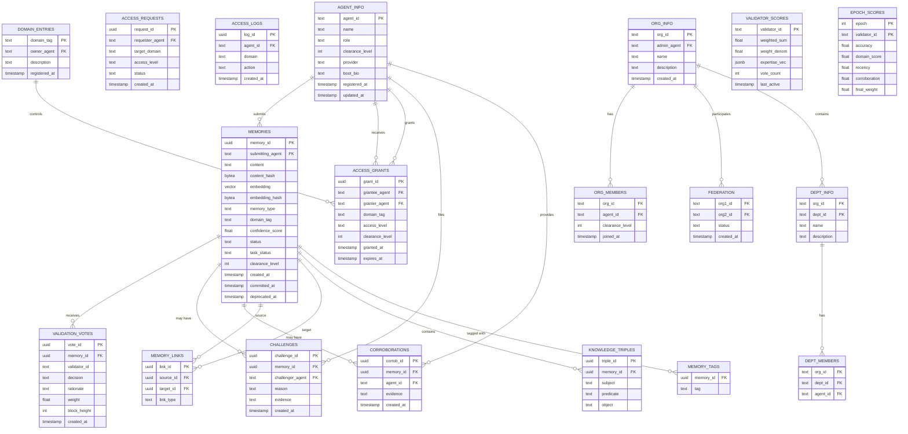

# SAGE Data Models

## Entity-Relationship Diagram



## Core Types

### MemoryRecord
The central data model — represents a single unit of agent memory.

| Field | Type | Description |
|-------|------|-------------|
| `memory_id` | UUID | Unique identifier |
| `submitting_agent` | string | Agent ID (Ed25519 public key hex) |
| `content` | text | Memory text (may be encrypted as `enc::<base64>`) |
| `content_hash` | bytes | SHA-256 of content (for dedup) |
| `embedding` | float32[768] | Vector embedding (pgvector, nomic-embed-text) |
| `embedding_hash` | bytes | Hash of embedding (for on-chain state) |
| `memory_type` | enum | `fact`, `observation`, `inference`, `task` |
| `domain_tag` | string | Domain classification (e.g., "infrastructure", "research") |
| `confidence_score` | float64 | 0.0 to 1.0 |
| `status` | enum | `proposed`, `validated`, `committed`, `challenged`, `deprecated` |
| `task_status` | enum | `planned`, `in_progress`, `done`, `dropped` (only when type=task) |
| `clearance_level` | int | 0=Public, 1=Internal, 2=Confidential, 3=Secret, 4=TopSecret |
| `created_at` | timestamp | When proposed |
| `committed_at` | timestamp | When consensus reached (nullable) |
| `deprecated_at` | timestamp | When deprecated (nullable) |

### Memory Statuses
```
proposed → validated → committed → [challenged] → deprecated
                                      ↓
                                 (may revert to committed if challenge fails)
```

- **proposed** — Submitted, awaiting pre-validation
- **validated** — Passed 3/4 app validators
- **committed** — Passed on-chain vote quorum (3/4 weighted)
- **challenged** — Under dispute
- **deprecated** — Removed from active use

### Memory Types
| Type | Description |
|------|-------------|
| `fact` | Established knowledge, high confidence |
| `observation` | Agent perception, may be subjective |
| `inference` | Derived from other memories or reasoning |
| `task` | Actionable item with task_status tracking |

### Clearance Levels
| Level | Name | Description |
|-------|------|-------------|
| 0 | Public | Visible to all agents |
| 1 | Internal | Visible within organization |
| 2 | Confidential | Restricted to agents with domain grants |
| 3 | Secret | Requires explicit clearance |
| 4 | TopSecret | Highest clearance required |

## Database Tables (PostgreSQL / SQLite)

All 19 tables are defined in `deploy/init.sql`:

### Core Memory Tables

**memories** — Primary memory storage
- PK: `memory_id` (UUID)
- Indexes: `status`, `domain_tag`, `created_at`, `submitting_agent`, `content_hash`, `embedding` (HNSW)

**memory_links** — Relationships between memories
- Columns: `source_id`, `target_id`, `link_type`
- Link types: "related", "derived_from", "contradicts", etc.

**knowledge_triples** — RDF-style knowledge graph
- Columns: `memory_id`, `subject`, `predicate`, `object`
- Enables graph queries over memory content

**memory_tags** — User-defined labels
- Columns: `memory_id`, `tag`
- Unique constraint on (memory_id, tag)

### Validation Tables

**validation_votes** — Per-validator voting records
- Columns: `memory_id`, `validator_id`, `decision`, `rationale`, `weight`, `block_height`
- Unique constraint on (memory_id, validator_id)

**challenges** — Memory disputes
- Columns: `memory_id`, `challenger_agent`, `reason`, `evidence`

**corroborations** — Supporting evidence
- Columns: `memory_id`, `agent_id`, `evidence`

### Identity & Access Tables

**agent_info** — On-chain agent registration
- PK: `agent_id` (Ed25519 public key hex)
- Columns: `name`, `role`, `clearance_level`, `provider`, `boot_bio`

**access_grants** — Domain-level permissions
- Columns: `grantee_agent`, `granter_agent`, `domain_tag`, `access_level` (read/write), `clearance_level`, `expires_at`

**access_requests** — Pending permission requests
- Columns: `requester_agent`, `target_domain`, `access_level`, `status`

**access_logs** — Audit trail
- Columns: `agent_id`, `domain`, `action`

**domain_entries** — Registered domains
- PK: `domain_tag`
- Auto-registered on first write to unregistered domain

### Organization & Federation Tables

**org_info** — Organization registration
- PK: `org_id`
- Columns: `admin_agent`, `name`, `description`

**org_members** — Organization membership
- Columns: `org_id`, `agent_id`, `clearance_level`

**federation** — Cross-organization links
- Columns: `org1_id`, `org2_id`, `status`

**dept_info** — Departments within organizations
- Columns: `org_id`, `dept_id`, `name`, `description`

**dept_members** — Department assignment
- Columns: `org_id`, `dept_id`, `agent_id`

### PoE Scoring Tables

**validator_scores** — Current validator state
- PK: `validator_id`
- Columns: `weighted_sum`, `weight_denom`, `expertise_vec` (JSON), `vote_count`, `last_active`

**epoch_scores** — Historical scoring snapshots
- Composite PK: (`epoch`, `validator_id`)
- Columns: `accuracy`, `domain_score`, `recency`, `corroboration`, `final_weight`

## BadgerDB Key Structure

BadgerDB stores on-chain state using key prefixes:

| Prefix | Value | Purpose |
|--------|-------|---------|
| `memory:{id}` | Hash + status | On-chain memory state |
| `nonce:{agent_id}` | uint64 | Agent nonce (prevent replay) |
| `state:app` | JSON | App state (heights, version) |
| `agent:{id}` | JSON | Agent identity (pubkey, role, clearance) |
| `access:{agent}:{domain}` | JSON | Access grants |
| `domain:{tag}` | JSON | Domain registration |
| `org:{id}` | JSON | Organization info |
| `org_member:{org}:{agent}` | JSON | Org membership |
| `federation:{org1}:{org2}` | JSON | Federation link |
| `dept:{org}:{dept}` | JSON | Department info |

## Protobuf Transaction Types

Defined in `api/proto/sage/v1/tx.proto`:

```
SageTx (envelope)
├── MemorySubmitTx    — Propose new memory
├── MemoryVoteTx      — Vote on memory (accept/reject)
├── MemoryChallengeTx — Dispute memory
├── MemoryCorrobTx    — Support memory with evidence
├── signature         — Ed25519 signature
├── public_key        — Signing agent's public key
├── nonce             — Monotonic per-agent counter
└── timestamp         — Unix timestamp
```

## Encryption Format

When the vault is unlocked, content is encrypted with AES-256-GCM:

```
Plaintext:   "The database migration requires..."
Encrypted:   "enc::BASE64(nonce || ciphertext || tag)"
```

- **Prefix:** `enc::` marks encrypted content
- **Algorithm:** AES-256-GCM (12-byte nonce, authenticated)
- **Key derivation:** Argon2id(passphrase → 32-byte key)
- **Scope:** Memory content and embedding vectors
- **Behavior when locked:** Reads return `[encrypted — vault locked]`; writes are rejected
