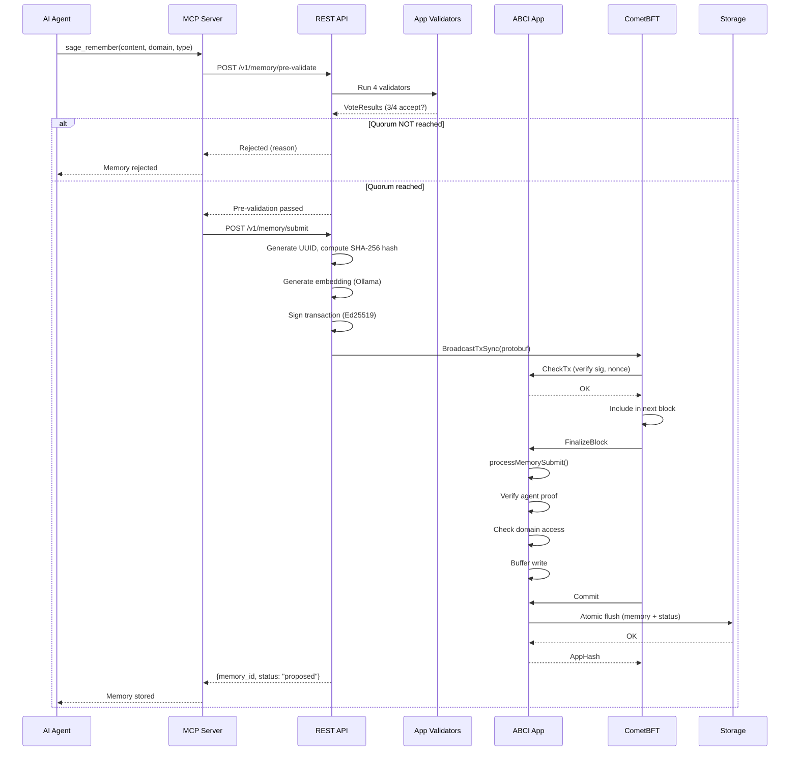
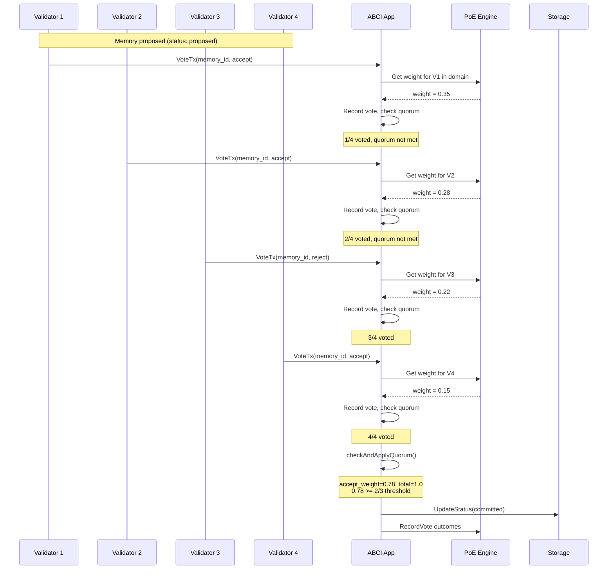
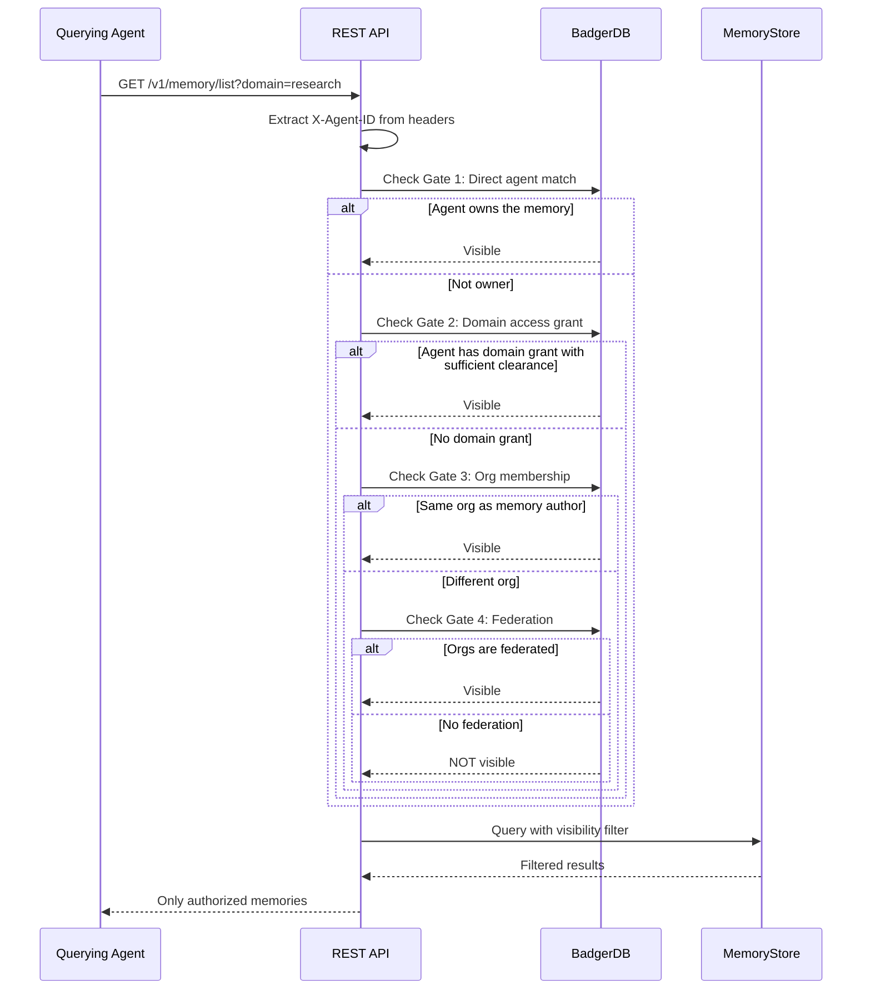
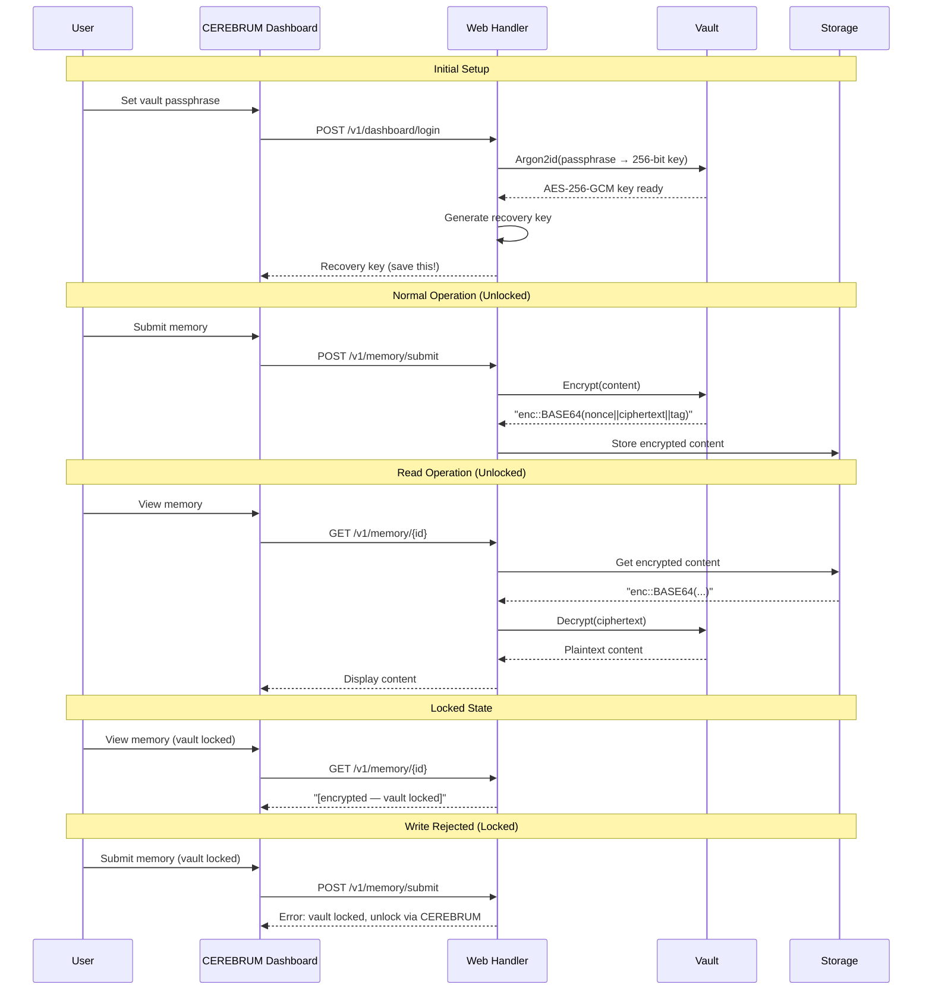
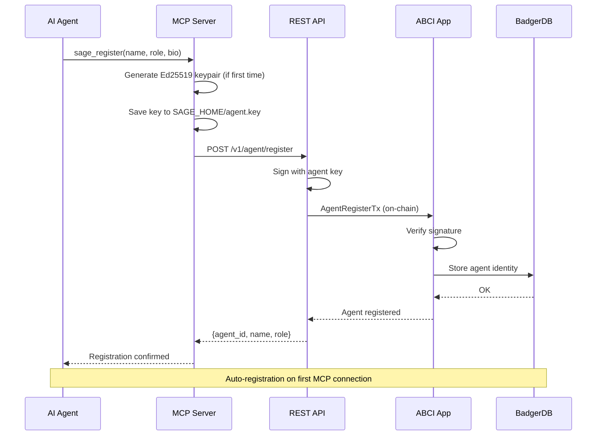
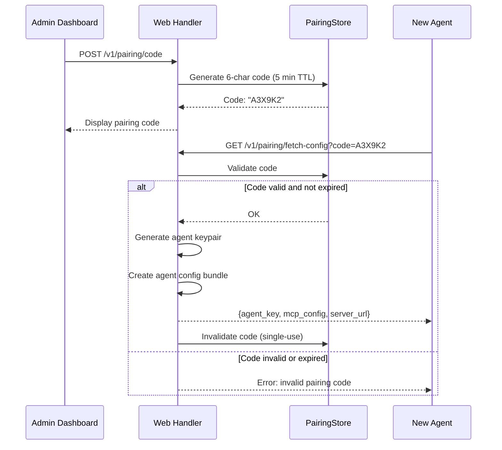
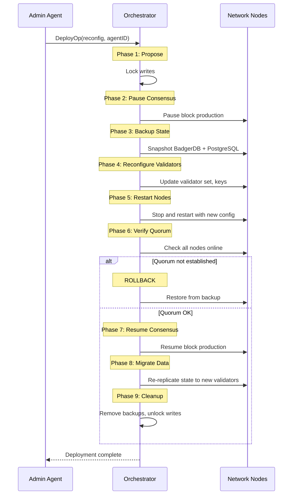
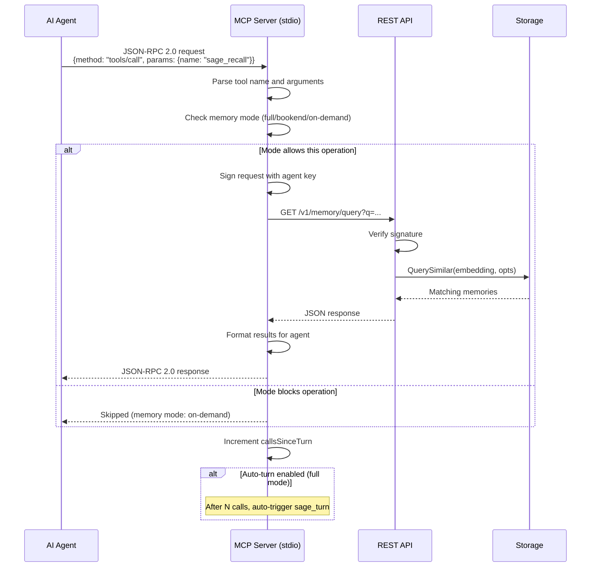
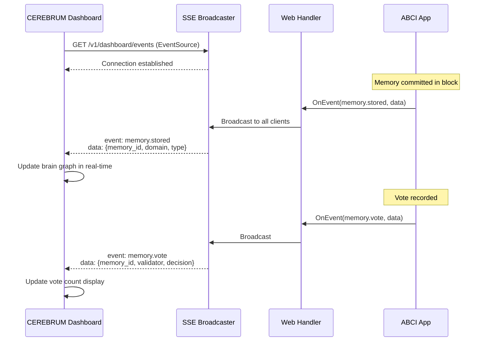
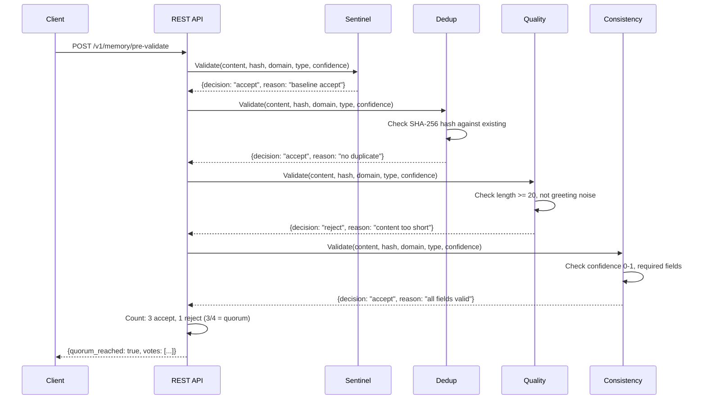

# SAGE Workflows

## 1. Memory Submission Pipeline

### Steps
1. Agent calls `sage_remember` via MCP
2. MCP server calls `/v1/memory/pre-validate` to dry-run 4 validators
3. If 3/4 validators accept, MCP proceeds to `/v1/memory/submit`
4. REST handler: generates UUID, computes SHA-256 content hash, generates embedding
5. REST handler: encodes protobuf transaction, signs with node key
6. Transaction broadcast to CometBFT via `BroadcastTxSync`
7. CometBFT calls `CheckTx` — ABCI verifies signature and nonce
8. Transaction included in next block (~3s block time)
9. CometBFT calls `FinalizeBlock` — ABCI processes memory submit
10. On-chain: verify agent proof, check domain access, buffer write
11. CometBFT calls `Commit` — ABCI flushes all buffered writes atomically
12. Memory stored with status "proposed"

## 2. Consensus Voting

### Steps
1. After a memory is proposed, validators submit vote transactions
2. Each vote is weighted by the PoE engine based on validator expertise
3. Weight formula: `exp(0.4·ln(accuracy) + 0.3·ln(domain) + 0.15·ln(recency) + 0.15·ln(corroboration))`
4. 10% reputation cap prevents single-validator dominance
5. `checkAndApplyQuorum()` runs after each vote
6. Quorum requires weighted accept votes ≥ 2/3 of total weight
7. If quorum reached: status → "committed"
8. If quorum impossible (too many rejects): status → "deprecated"
9. PoE engine records vote outcomes for future weight calculations

## 3. RBAC Access Control Flow

### Access Control Gates (checked in order)
1. **Direct agent match** — Agent submitted the memory → always visible
2. **Domain access grant** — Agent has explicit read/write on the domain AND agent clearance ≥ memory clearance level
3. **Organization membership** — Agent is in the same org as the memory author
4. **Federation** — Agent's org and author's org have approved federation
5. **Default** — Fail-secure: not visible

DomainAccess and multi-org gates are **alternatives**, not stacked. Passing one skips the others.

## 4. Vault Encryption Lifecycle

### Key Points
- Passphrase → Argon2id → 256-bit AES key (memory-hard, GPU-resistant)
- Encrypted format: `enc::<base64(12-byte nonce || ciphertext || GCM tag)>`
- When locked: reads return placeholder, writes are rejected
- Recovery key allows passphrase reset without data loss
- Vault key file auto-backed up on upgrade

## 5. Agent Registration

### Steps
1. On first MCP connection, `sage-gui` generates Ed25519 keypair
2. Key saved to `SAGE_HOME/agent.key`
3. Agent ID = hex-encoded public key
4. Registration transaction submitted on-chain
5. BadgerDB stores agent identity (name, role, clearance, provider)
6. Subsequent connections auto-authenticate with saved key

## 6. LAN Pairing

## 7. Network Redeployment (9-Phase State Machine)

### Key Features
- Rollback possible at every phase
- Writes locked during redeployment (REST returns 503 via middleware)
- State backed up before any changes
- CometBFT 1/3 max power change constraint enforced

## 8. MCP Tool Execution

### Memory Mode Behavior
| Mode | Boot | Turn | Reflect | Manual |
|------|------|------|---------|--------|
| `full` | Load inception memories | Auto-save observations | Save reflections | Always available |
| `bookend` | Load inception memories | Skip | Save reflections | Always available |
| `on-demand` | Skip | Skip | Skip | Only explicit sage_remember |

## 9. Dashboard SSE Events

### Event Types
- `memory.stored` — New memory committed to chain
- `memory.recalled` — Query executed, results returned
- `memory.deprecated` — Memory deprecated
- `memory.challenge` — Dispute filed against memory
- `memory.vote` — Validator voted on memory
- `chain.block` — New block produced

## 10. Pre-Validation Flow

### Validator Behavior
| Validator | Accept When | Reject When |
|-----------|-------------|-------------|
| Sentinel | Always | Never (ensures liveness) |
| Dedup | No matching SHA-256 hash | Duplicate content exists |
| Quality | Length ≥ 20, not greeting noise | Too short, greeting phrases, empty headers |
| Consistency | Valid confidence (0-1), required fields present | Out-of-range confidence, missing fields |
